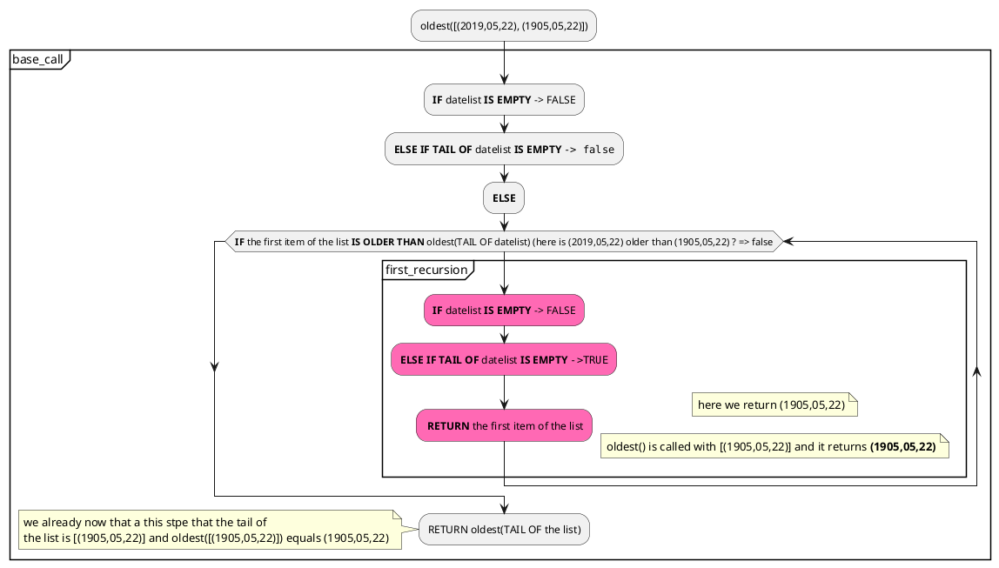
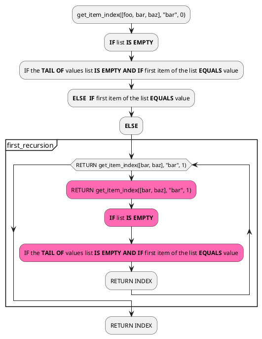
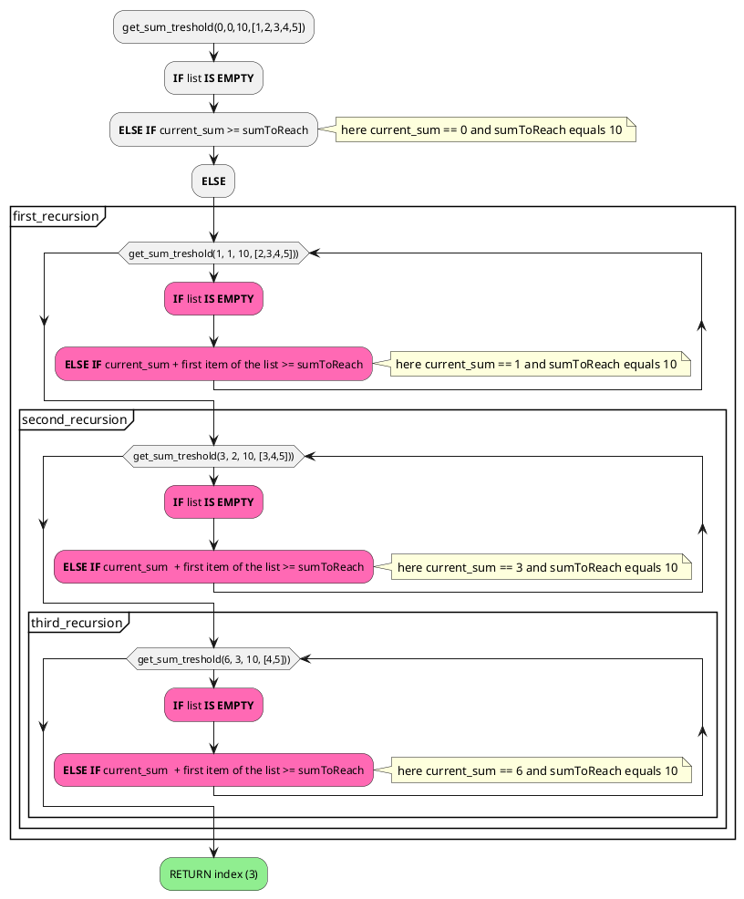

# WEEK 1

## Checking loop

### 1. Syntax

Check if the keyword used are correct (if, then, else, ...)

### 2. Type-Checking

Check the type of the provided expressions. Check if the expression have the same type.

### 3. Evaluation Rules

First evaluate

## Shadowing

Shadowing is when a expression value is assigned again to another value

## List

## `::` (CONS operator)

CONS append an item at the first place of a list
e1::[1,2,3] => [e1, 1,2,3]

## Algorithms

### OLDEST

#### PSEUDO CODE

```
    oldest(dateList)
        IF datelist IS EMPTY
            RETURN ??? (need to figure out what to return)
        ELSE IF TAIL OF datelist IS EMPTY
            RETURN the first item of list
        ELSE
            IF the first item of the list IS OLDER THAN oldest(TAIL OF datelist)
                RETURN the first item of the list
            ELSE
                RETURN oldest(TAIL OF the list)
```

#### TESTS



### number_before_reaching_sum

#### Instructions

Write a function number_before_reaching_sum that takes an int called sum, which you can assume is positive, and an int list, which you can assume contains all positive numbers, and returns an int.

You should return an int such that the first elements of the list add to less than sum, but the first n+ 1 elements of the list add to sum or more. Assume the entire list sums to more than the passed invalue; it is okay for an exception to occur if this is not the case.

=> In other word, we shoud figure out which is the index of item added to the sum of the previous one is less or equals the sum.

#### Let's break the problem:

How can we find the index of an item in a array ?

Let's say we have this array `[foo, bar, baz]` and we want to know the index of the item `baz` (which should be 3)

##### PSEUDO CODE

```sml
fun  get_item_index(values : int list, value, index) =
    IF LIST IS EMPTY
        RETURN -1
    ELSE  IF first item of the list EQUALS value
        RETURN index
    ELSE
        RETURN get_item_index(TAIL OF values list, value, index +1)

```

##### Tests



So now we can figure out to replicate the same logic and find a the "treshold" index of our array of number. Let's try out!

So for a given array `[1,2,3,4,5]` and for a given sum `10` we want `3` to be returned. Pay attention because here `3` means the index `3` not the value inside the array.

##### PSEUDO CODE

```sml
fun  get_sum_treshold(current_sum, index, sumToReach, list) =
    IF list IS EMPTY
        RETURN 0
    ELSE  IF current_sum + first item of the list >= sumToReach
        RETURN index
    ELSE
        RETURN get_sum_treshold(current_sum + HEAD OF list, index +1 , sumToReach, list)
```

##### TESTS



This function does not really answer to the first need. The function we have to write takes only two arguments :

- an int called sum
- an int list

The previous function we wrote takes much more arguments. So how could we rewrite our function to pass the required arguments only ? Maybe could we transform `get_sum_treshold` in a nested function ?

Let's write this out !

```sml
fun  number_before_reaching_sum (sum:int, list: int list) : int =

        (*Here we declare get_sum_treshold as a nested function of number_before_reaching_sum*)
        (*get_sum_treshold only lives inside the scope of number_before_reaching_sum*)

        DECLARE function  get_sum_treshold(current_sum, index, list) =
                     IF list IS EMPTY
                        RETURN 0
                     ELSE  IF current_sum + first item of the list >= sum
                        RETURN index
                     ELSE
                        RETURN get_sum_treshold(current_sum + HEAD OF list, index +1 , sum, list)

        get_sum_treshold(0,0,list)

```
